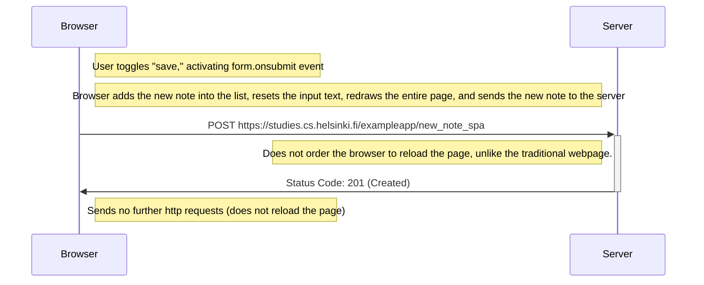

```mermaid
    sequenceDiagram
        participant Browser
        participant Server

    Note right of Browser: User toggles "save," activating form.onsubmit event

    Note right of Browser: Browser adds the new note into the list, resets the input text, redraws the entire page, and sends the new note to the server

    Browser ->>+ Server: POST https://studies.cs.helsinki.fi/exampleapp/new_note_spa

    Note left of Server: Does not order the browser to reload the page, unlike the traditional webpage.
    Server ->>- Browser: Status Code: 201 (Created)

    Note right of Browser: Sends no further http requests (does not reload the page)
```