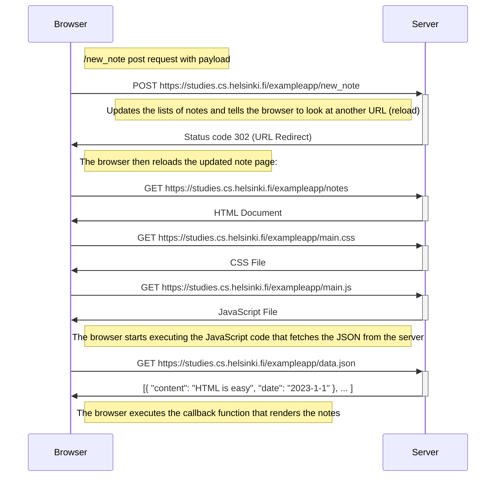

```mermaid
  sequenceDiagram
    participant Browser
    participant Server

    Note right of Browser: /new_note post request with payload
    Browser ->>+ Server: POST https://studies.cs.helsinki.fi/exampleapp/new_note

    Note left of Server: Updates the lists of notes and tells the browser to look at another URL (reload)
    Server ->>- Browser: Status code 302 (URL Redirect)

    Note right of Browser: The browser then reloads the updated note page:
    Browser ->>+ Server: GET https://studies.cs.helsinki.fi/exampleapp/notes
    Server ->>- Browser: HTML Document

    Browser ->>+ Server: GET https://studies.cs.helsinki.fi/exampleapp/main.css
    Server ->>- Browser: CSS File

    Browser ->>+ Server: GET https://studies.cs.helsinki.fi/exampleapp/main.js
    Server ->>- Browser: JavaScript File

    Note right of Browser: The browser starts executing the JavaScript code that fetches the JSON from the server
    
    Browser ->>+ Server: GET https://studies.cs.helsinki.fi/exampleapp/data.json
    Server ->>- Browser: [{ "content": "HTML is easy", "date": "2023-1-1" }, ... ]

    Note right of Browser: The browser executes the callback function that renders the notes
```