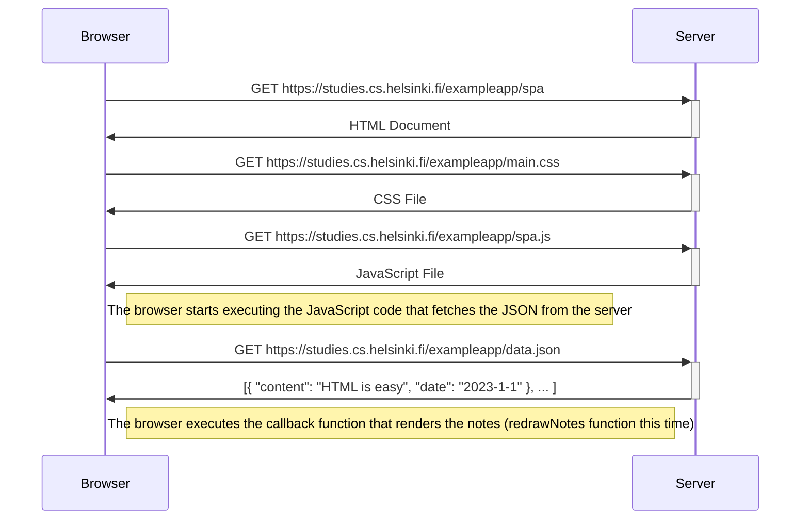

```mermaid
  sequenceDiagram
    participant Browser
    participant Server

    Browser ->>+ Server: GET https://studies.cs.helsinki.fi/exampleapp/spa
    Server ->>- Browser: HTML Document

    Browser ->>+ Server: GET https://studies.cs.helsinki.fi/exampleapp/main.css
    Server ->>- Browser: CSS File

    Browser ->>+ Server: GET https://studies.cs.helsinki.fi/exampleapp/spa.js
    Server ->>- Browser: JavaScript File

    Note right of Browser: The browser starts executing the JavaScript code that fetches the JSON from the server
    
    Browser ->>+ Server: GET https://studies.cs.helsinki.fi/exampleapp/data.json
    Server ->>- Browser: [{ "content": "HTML is easy", "date": "2023-1-1" }, ... ]

    Note right of Browser: The browser executes the callback function that renders the notes (redrawNotes function this time)
```